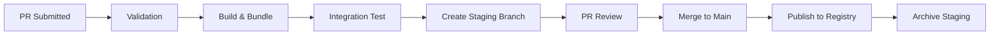

# Clanker Tools Build Pipeline Design

## Overview
This document details the automated build pipeline for clanker tools, from source submission to published registry entry.

## Pipeline Architecture



## Build Configuration

### 1. Tool Source Structure
```
submissions/
└── org-name/
    └── tool-name/
        ├── package.json          # Tool metadata and scripts
        ├── src/
        │   └── index.ts         # Tool implementation
        ├── README.md            # Tool documentation
        └── examples/            # Usage examples
```

### 2. Package.json Format
```json
{
  "name": "@org/tool-name",
  "version": "1.0.0",
  "description": "Tool description",
  "main": "src/index.ts",
  "author": {
    "name": "Author Name",
    "email": "email@example.com"
  },
  "repository": "https://github.com/user/tool",
  "clanker": {
    "category": "System",
    "capabilities": ["SystemExecute", "UserConfirmation"],
    "tags": ["bash", "shell"],
    "minVersion": "0.1.33"
  },
  "peerDependencies": {
    "@ziggler/clanker": "*",
    "react": "*",
    "ink": "*"
  },
  "devDependencies": {
    "typescript": "^5.0.0",
    "@types/react": "^19.0.0"
  }
}
```

### 3. Build Script Implementation

```javascript
// scripts/build-tool.js
const esbuild = require('esbuild');
const fs = require('fs-extra');
const path = require('path');
const crypto = require('crypto');

async function buildTool(submissionPath, outputPath) {
  const packageJson = await fs.readJson(path.join(submissionPath, 'package.json'));
  
  // Extract metadata from package.json and source
  const metadata = await extractMetadata(submissionPath, packageJson);
  
  // Bundle the tool
  const result = await esbuild.build({
    entryPoints: [path.join(submissionPath, 'src/index.ts')],
    bundle: true,
    format: 'cjs',
    platform: 'node',
    target: 'node16',
    external: [
      'react',
      'ink',
      '@ziggler/clanker',
      'fs',
      'path',
      'child_process',
      'util',
      'os',
      'crypto'
    ],
    outfile: path.join(outputPath, 'index.js'),
    metafile: true,
    minify: true,
    sourcemap: false,
    plugins: [
      preserveMetadataPlugin(metadata)
    ]
  });
  
  // Generate manifest
  const manifest = {
    id: metadata.id,
    name: metadata.name,
    description: metadata.description,
    version: packageJson.version,
    author: packageJson.author,
    repository: packageJson.repository,
    category: packageJson.clanker.category,
    capabilities: packageJson.clanker.capabilities,
    tags: packageJson.clanker.tags,
    dependencies: {
      external: Object.keys(packageJson.peerDependencies || {}),
      bundled: Object.keys(packageJson.dependencies || {})
    },
    clankerVersion: packageJson.clanker.minVersion,
    buildInfo: {
      date: new Date().toISOString(),
      builder: 'esbuild',
      sourceHash: await hashDirectory(submissionPath),
      bundleSize: result.metafile.outputs['index.js'].bytes,
      originalSize: await getDirectorySize(submissionPath)
    }
  };
  
  await fs.writeJson(path.join(outputPath, 'manifest.json'), manifest, { spaces: 2 });
  
  return manifest;
}

// Plugin to ensure metadata is preserved in the bundle
function preserveMetadataPlugin(metadata) {
  return {
    name: 'preserve-metadata',
    setup(build) {
      build.onEnd(async (result) => {
        if (result.errors.length > 0) return;
        
        // Append metadata preservation code
        const bundlePath = build.initialOptions.outfile;
        let content = await fs.readFile(bundlePath, 'utf8');
        
        // Ensure the exported tool has all metadata
        content += `
// Preserve tool metadata
if (module.exports && module.exports.default) {
  const tool = module.exports.default;
  if (!tool.category) tool.category = ${JSON.stringify(metadata.category)};
  if (!tool.capabilities) tool.capabilities = ${JSON.stringify(metadata.capabilities)};
  if (!tool.tags) tool.tags = ${JSON.stringify(metadata.tags)};
}
`;
        
        await fs.writeFile(bundlePath, content);
      });
    }
  };
}
```

### 4. Integration Test Script

```javascript
// scripts/test-integration.js
const { exec } = require('child_process');
const fs = require('fs-extra');
const path = require('path');
const os = require('os');

async function testToolIntegration(toolPath, manifest) {
  const testDir = path.join(os.tmpdir(), `clanker-test-${Date.now()}`);
  
  try {
    // 1. Clone latest clanker
    await execAsync(`git clone https://github.com/ziggle-dev/clanker ${testDir}/clanker`);
    
    // 2. Install dependencies
    await execAsync('npm install', { cwd: `${testDir}/clanker` });
    
    // 3. Create test .clanker directory
    const toolsDir = path.join(testDir, '.clanker/tools', manifest.author.name, manifest.id, manifest.version);
    await fs.ensureDir(toolsDir);
    
    // 4. Copy tool files
    await fs.copy(toolPath, toolsDir);
    
    // 5. Run clanker with list-tools
    const { stdout } = await execAsync(
      `HOME=${testDir} npm run dev -- --list-tools`,
      { cwd: `${testDir}/clanker` }
    );
    
    // 6. Verify tool appears
    if (!stdout.includes(manifest.id)) {
      throw new Error(`Tool ${manifest.id} not found in list-tools output`);
    }
    
    // 7. Test basic tool execution
    const testResult = await execAsync(
      `HOME=${testDir} npm run dev -- -p "test ${manifest.id} tool"`,
      { cwd: `${testDir}/clanker`, timeout: 30000 }
    );
    
    return {
      success: true,
      output: stdout,
      testResult: testResult.stdout
    };
    
  } finally {
    // Cleanup
    await fs.remove(testDir);
  }
}
```

### 5. GitHub Actions Workflow

```yaml
# .github/workflows/tool-submission.yml
name: Tool Submission Pipeline

on:
  pull_request:
    paths:
      - 'submissions/**'

jobs:
  validate-and-build:
    runs-on: ubuntu-latest
    
    steps:
      - uses: actions/checkout@v3
      
      - name: Setup Node.js
        uses: actions/setup-node@v3
        with:
          node-version: '20'
      
      - name: Get changed files
        id: files
        uses: jitterbit/get-changed-files@v1
      
      - name: Extract tool info
        id: tool-info
        run: |
          # Parse the submission path to get org/tool
          TOOL_PATH=$(echo "${{ steps.files.outputs.all }}" | grep -E "^submissions/[^/]+/[^/]+/" | head -1)
          ORG=$(echo $TOOL_PATH | cut -d'/' -f2)
          TOOL=$(echo $TOOL_PATH | cut -d'/' -f3)
          VERSION=$(cat $TOOL_PATH/package.json | jq -r .version)
          
          echo "org=$ORG" >> $GITHUB_OUTPUT
          echo "tool=$TOOL" >> $GITHUB_OUTPUT
          echo "version=$VERSION" >> $GITHUB_OUTPUT
          echo "path=$TOOL_PATH" >> $GITHUB_OUTPUT
          echo "branch=$ORG/$TOOL@$VERSION" >> $GITHUB_OUTPUT
      
      - name: Validate tool structure
        run: |
          node scripts/validate-tool.js ${{ steps.tool-info.outputs.path }}
      
      - name: Build tool
        run: |
          mkdir -p build-output
          node scripts/build-tool.js ${{ steps.tool-info.outputs.path }} build-output
      
      - name: Test integration
        run: |
          node scripts/test-integration.js build-output manifest.json
      
      - name: Create staging branch
        if: success()
        run: |
          git config user.name "Clanker Bot"
          git config user.email "bot@clanker.dev"
          
          # Create and checkout staging branch
          git checkout -b ${{ steps.tool-info.outputs.branch }}
          
          # Copy built files to registry location
          mkdir -p tools/${{ steps.tool-info.outputs.org }}/${{ steps.tool-info.outputs.tool }}/${{ steps.tool-info.outputs.version }}
          cp build-output/* tools/${{ steps.tool-info.outputs.org }}/${{ steps.tool-info.outputs.tool }}/${{ steps.tool-info.outputs.version }}/
          
          # Commit and push
          git add tools/
          git commit -m "Built tool: ${{ steps.tool-info.outputs.org }}/${{ steps.tool-info.outputs.tool }}@${{ steps.tool-info.outputs.version }}"
          git push origin ${{ steps.tool-info.outputs.branch }}
      
      - name: Comment on PR
        uses: actions/github-script@v6
        with:
          script: |
            const output = `
            ## 🎉 Tool Build Successful!
            
            **Tool**: \`${{ steps.tool-info.outputs.org }}/${{ steps.tool-info.outputs.tool }}@${{ steps.tool-info.outputs.version }}\`
            **Staging Branch**: \`${{ steps.tool-info.outputs.branch }}\`
            
            ### Test Results ✅
            - Structure validation: Passed
            - Build process: Successful
            - Integration test: Tool detected in clanker
            
            ### Next Steps
            1. Review the built tool in the staging branch
            2. Test experimental installation:
               \`\`\`bash
               clanker --enable-experimental
               clanker --install ${{ steps.tool-info.outputs.org }}/${{ steps.tool-info.outputs.tool }}@${{ steps.tool-info.outputs.branch }}
               \`\`\`
            3. Approve and merge this PR to publish to the main registry
            `;
            
            github.rest.issues.createComment({
              issue_number: context.issue.number,
              owner: context.repo.owner,
              repo: context.repo.repo,
              body: output
            });

  security-scan:
    runs-on: ubuntu-latest
    steps:
      - uses: actions/checkout@v3
      - name: Run security scan
        run: |
          # Add security scanning tools here
          npm audit
          # Check for dangerous patterns
          node scripts/security-check.js ${{ steps.tool-info.outputs.path }}
```

### 6. Post-Merge Workflow

```yaml
# .github/workflows/registry-update.yml
name: Registry Update

on:
  pull_request:
    types: [closed]
    branches: [main]

jobs:
  publish-tool:
    if: github.event.pull_request.merged == true
    runs-on: ubuntu-latest
    
    steps:
      - uses: actions/checkout@v3
      
      - name: Extract tool info from PR
        id: tool-info
        run: |
          # Extract from PR body or labels
          echo "branch=${{ github.event.pull_request.head.ref }}" >> $GITHUB_OUTPUT
      
      - name: Merge staging to registry
        run: |
          # Copy from staging branch to main
          git fetch origin ${{ steps.tool-info.outputs.branch }}
          git checkout ${{ steps.tool-info.outputs.branch }}
          
          # Copy tool files
          cp -r tools/* ../main-tools/
          
          git checkout main
          cp -r ../main-tools/* tools/
          
          # Update registry.json
          node scripts/update-registry.js
          
          git add .
          git commit -m "Published tool from ${{ steps.tool-info.outputs.branch }}"
          git push
      
      - name: Archive staging branch
        run: |
          git push origin :${{ steps.tool-info.outputs.branch }}
          git tag archive/${{ steps.tool-info.outputs.branch }}
          git push origin archive/${{ steps.tool-info.outputs.branch }}
```

## Package Manager Integration

### 1. Experimental Tools Support

```typescript
// src/package-manager/experimental.ts
export class ExperimentalToolManager {
  async fetchExperimentalTools(): Promise<ExperimentalTool[]> {
    // Fetch branches matching pattern org/tool@version
    const branches = await this.fetchGitHubBranches();
    return branches
      .filter(branch => branch.match(/^[^/]+\/[^/]+@[\d.]+$/))
      .map(branch => this.parseBranchToTool(branch));
  }
  
  async installExperimental(toolSpec: string): Promise<void> {
    // Check if it's a PR reference
    if (toolSpec.includes('@pr-')) {
      const prNumber = toolSpec.split('@pr-')[1];
      const branch = await this.getBranchFromPR(prNumber);
      toolSpec = branch;
    }
    
    // Download from staging branch
    const toolUrl = `${this.repoUrl}/tree/${toolSpec}/tools/...`;
    await this.downloadAndInstall(toolUrl);
    
    // Mark as experimental in local manifest
    await this.markAsExperimental(toolSpec);
  }
  
  async upgradeToStable(): Promise<void> {
    const experimental = await this.getInstalledExperimental();
    
    for (const tool of experimental) {
      const stableVersion = await this.checkIfStable(tool);
      if (stableVersion) {
        await this.upgrade(tool, stableVersion);
      }
    }
  }
}
```

### 2. CLI Integration

```typescript
// Update src/commands/package.ts
.option('--enable-experimental', 'Enable installation of experimental tools')
.option('--list-experimental', 'List available experimental tools')
.option('--upgrade-experimental', 'Upgrade experimental tools to stable versions')
```

## Benefits

1. **Quality Assurance**: Every tool is tested before publishing
2. **Experimentation**: Users can test tools before they're merged
3. **Traceability**: Full history of tool versions and changes
4. **Automation**: Minimal manual intervention required
5. **Security**: Automated scanning and validation

## Implementation Timeline

1. Week 1: Build scripts and basic workflow
2. Week 2: Integration testing and staging branches
3. Week 3: Package manager experimental support
4. Week 4: Migration of existing tools